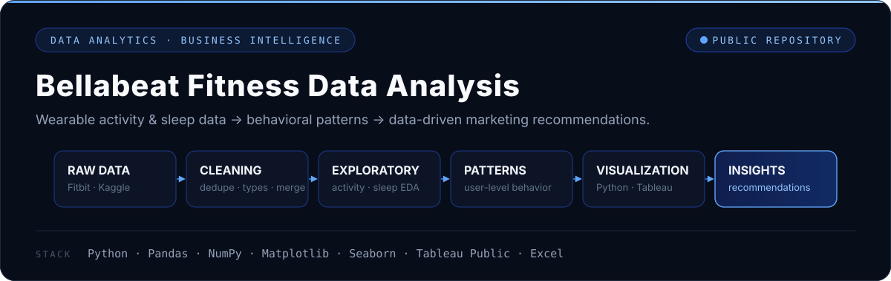
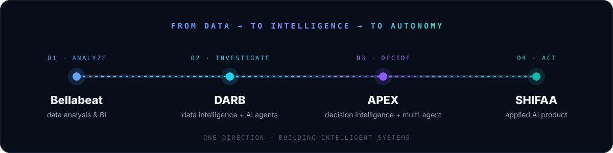

<h3>Building intelligent systems that combine AI agents, LLMs, machine learning, and data to solve real-world problems.</h3>

<code>Python</code>&nbsp; <code>SQL</code>&nbsp; <code>LangGraph</code>&nbsp; <code>FastAPI</code>&nbsp; <code>RAG</code>&nbsp; <code>PostgreSQL</code>&nbsp; <code>Machine Learning</code>

<a href="#featured-projects"><b>Projects</b></a> &nbsp;·&nbsp;
<a href="#experience"><b>Experience</b></a> &nbsp;·&nbsp;
<a href="#tech-stack"><b>Stack</b></a> &nbsp;·&nbsp;
<a href="#contact"><b>Contact</b></a> &nbsp;·&nbsp;
Amman, Jordan

 

## What I build

<table>
<tr>
<td width="50%" valign="top">

**`01` &nbsp;Agentic AI**

Agents with defined responsibilities, coordinated by an explicit orchestration layer instead of left to improvise.

AI agents · agentic workflows · multi-agent orchestration · LLM applications · tool-based workflows · RAG

</td>
<td width="50%" valign="top">

**`02` &nbsp;Data Intelligence**

Systems that go past *what* changed in the data and investigate *why* — with the evidence attached.

Business intelligence · analytical investigation · evidence-grounded answers · data validation · machine learning

</td>
</tr>
<tr>
<td width="50%" valign="top">

**`03` &nbsp;Decision Intelligence**

Decisions examined from several specialized angles, checked, and escalated to people when the stakes require it.

Multi-perspective reasoning · enterprise decision support · organizational memory · governance · verification

</td>
<td width="50%" valign="top">

**`04` &nbsp;AI Products**

End-to-end applications that put AI inside a real workflow — with the backend, data model, and controls around it.

Conversational AI · AI assistants · backend AI systems · end-to-end applications · real business workflows

</td>
</tr>
</table>

 

## Featured projects

<table>
<tr>
<td width="50%" valign="top">

**The problem** 
Dashboards show *what* changed. Finding out *why* still takes an analyst, a query editor, and hours of back-and-forth — and the answer rarely shows its evidence.

</td>
<td width="50%" valign="top">

**What I built** 
Designed and built DARB: an investigation workflow that plans, queries the data read-only, tests candidate causes, and answers with the queries and results behind every figure.

</td>
</tr>
</table>

<b>Capabilities &amp; architecture</b>

 

| Layer | What it does |
|---|---|
| **Investigation** | Business-question investigation · planning · multi-agent orchestration · hypothesis management |
| **Analysis** | SQL generation · data-quality analysis · statistical analysis · visualization · reporting |
| **Trust** | Evidence grounding · validation · verification — any figure no query result supports is flagged as unverified |
| **Operations** | Scheduled metric monitoring that can start an investigation on its own · organization-scoped access · audit trail |
| **Interface** | Arabic and English, Arabic-first RTL |

**Stack** &nbsp; Python · FastAPI · SQL · DuckDB · PostgreSQL · RAG · Claude / OpenAI · Next.js · TypeScript

<b>PRIVATE PROJECT</b> — the case study above is the public layer.

 

**APEX is a completed enterprise-grade multi-agent decision intelligence platform I designed and built to orchestrate specialized AI executives, retrieve organizational knowledge, validate evidence, apply governance controls, and produce structured, auditable decisions.**

Agentic AI · Multi-Agent Systems · LLM Engineering · RAG · Decision Intelligence · AI Governance · Backend Architecture

<table>
<tr>
<td width="50%" valign="top">

**The problem** 
Cross-functional decisions crawl through departments one at a time, while a general-purpose assistant offers a single unchecked narrative — with no way to notice that its financial assumption contradicts its legal one.

</td>
<td width="50%" valign="top">

**What I built** 
I architected the system and implemented it end to end: a LangGraph state graph that runs ten specialized executive agents, retrieves precedent from organizational memory, verifies every claim, and escalates to a human whenever a governance threshold is crossed.

</td>
</tr>
</table>

<b>The ten specialized units</b> — distinct responsibilities, not ten copies of one chatbot

 

| Unit | Responsibility |
|---|---|
| **CEO** | Executive orchestrator — decomposes the decision and coordinates the council |
| **CFO** | Financial implications |
| **CMO** | Market and marketing considerations |
| **CRO** | Revenue implications |
| **CLO** | Legal and compliance — a veto gate before a decision can pass |
| **CHRO** | Workforce and organizational implications |
| **CTO** | Technical feasibility |
| **CDO** | Organizational memory — retrieves relevant precedents *before* analysis begins |
| **QA** | Quality assurance — checks claims and output consistency |
| **BRD** | Board governance — escalation rules decide when a human must decide or approve |

<b>What I engineered</b>

 

| Layer | Implementation |
|---|---|
| **Orchestration** | Deterministic LangGraph state graph with parallel executive analysis and negotiation when positions conflict |
| **Agents** | The executive agent ecosystem — each unit role-constrained to one perspective on the decision |
| **Memory & RAG** | Organizational memory and precedent retrieval on PostgreSQL + pgvector |
| **Verification** | QA layer that checks claims, evidence, and consistency before a decision is assembled |
| **Decision intelligence** | Structured decision dossiers built from the council's verified output |
| **Governance** | Board escalation rules, human approval, and role-based authority over consequential decisions |
| **Auditability** | Decision traces — every step recorded, replayable, and auditable |
| **Platform** | FastAPI backend, Next.js frontend integration, persistence, and a provider-agnostic model-routing abstraction |

Taken through final hardening and verification as a completed system.

<b>STATUS: COMPLETED</b> &nbsp;·&nbsp; PRIVATE — ARCHITECTURE CASE STUDY

 

<table>
<tr>
<td width="50%" valign="top">

**The problem** 
Clinic teams lose their day to routine WhatsApp messages, calendar changes, and reminders — while freed-up appointment slots sit empty.

</td>
<td width="50%" valign="top">

**What I built** 
Designed and built end-to-end: a WhatsApp agent that books against real availability, answers from the clinic's own documents, sends reminders, offers freed slots to a waitlist, and hands anything clinical or uncertain to staff — plus the staff dashboard and copilot.

</td>
</tr>
</table>

<b>PRIVATE PROJECT</b> &nbsp;·&nbsp; Python · FastAPI · LangGraph · Claude · PostgreSQL · pgvector · WhatsApp Cloud API · Next.js · TypeScript

 

Analysis of Fitbit activity and sleep data to support Bellabeat's marketing strategy: cleaning and merging the datasets, engineering an *awake-in-bed* feature, user-level behavioural analysis, and recommendations such as personalized activity reminders and behavioural segmentation.

<a href="https://github.com/ramilebdeh2005-ux/Bellabelt"><b>View repository →</b></a>

 

## The thread

Different problems, one direction: turning data and AI agents into systems people can actually rely on.

 

## Experience

**AI Intern — Shamsieh Technology Services** &nbsp;·&nbsp; Amman, Jordan &nbsp;·&nbsp; July 2026 – August 2026 &nbsp;·&nbsp; 240 hours

- Built a grounded RAG knowledge-base assistant with source citations and explicit "not found" handling — [`AI-Agent`](https://github.com/ramilebdeh2005-ux/AI-Agent).

 

## Tech stack

| Area | Technologies |
|---|---|
| **AI & Agentic AI** | AI Agents · Agentic Workflows · Multi-Agent Systems · LLM Applications · RAG · LangGraph |
| **Programming** | Python · SQL · TypeScript |
| **ML & Data Science** | Machine Learning · Deep Learning · NLP · Scikit-learn · Pandas · NumPy · EDA · Data Cleaning · Feature Engineering · Predictive Modeling · Model Evaluation |
| **Backend & Data** | FastAPI · REST APIs · PostgreSQL · DuckDB |
| **Analytics & BI** | Power BI · Tableau · Data Analysis · Data Visualization · Dashboard Development |
| **Frontend** | Next.js · React · Tailwind CSS |
| **Tools** | Git · GitHub · Jira · Jupyter Notebook · VS Code |

 

## Engineering approach

| Principle | In practice |
|---|---|
| **Build systems, not demos** | Auth, audit trails, tests, and failure handling are part of the first design, not a later phase. |
| **Ground AI outputs in evidence** | DARB attaches the query and result behind every figure, and flags any number nothing supports. |
| **Probabilistic AI, deterministic checks** | In SHIFAA the model chooses what to ask for; deterministic code decides what is allowed to happen. |
| **Agents around clear responsibilities** | APEX units are role-constrained — each owns one perspective on the decision. |
| **Orchestration over improvisation** | Explicit state graphs define who runs, when, and with which inputs. |
| **Governance is system design** | Human approval and escalation thresholds are built in, not bolted on. |
| **Real problems first** | Start from a workflow someone actually runs, then decide where AI belongs in it. |

 

## Currently exploring

Agentic AI · Multi-Agent Systems · LLM Applications · RAG · AI Data Intelligence · Decision Intelligence · Machine Learning · Production-oriented AI systems · AI system architecture

 

## Education & certifications

**B.Sc. in Data Science and Artificial Intelligence** — Amman Arab University &nbsp;·&nbsp; Expected 2027

| Issuer | Certification |
|---|---|
| **IBM** | Building AI Agents and Agentic Workflows |
| **Microsoft** | Power BI Data Analyst Professional Certificate |
| **Google** | Data Analytics Professional Certificate |
| **Microsoft Certified** | Azure Data Fundamentals (DP-900) |
| **Shamsieh Technology Services** | Certificate of AI Practical Training (240 hours) |

 

## Contact

Open to conversations about AI engineering, agentic systems, and data intelligence.